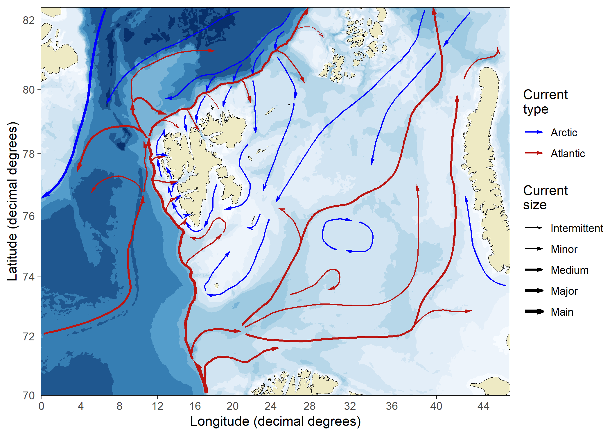
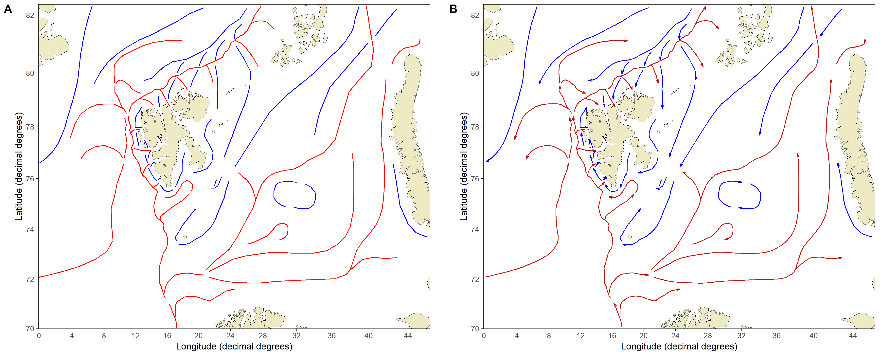

Barents Sea ocean-current arrows
======
**Data repository for updated Barents Sea ocean current arrows (Institute of Marine Research and Norwegian Polar Institute). Version 0.1 (2018-12-13)**

This site contains geospatial data for Barents Sea ocean current arrows, which are meant for scientific publications as *"Figure 1"*-type arrows indicating the *influence* of Atlantic and Arctic surface currents on different areas within the region. The current arrows are generalizations and do not consider mass-balance, seasonality, and other variations. The arrows are, however, based on the current understanding of ocean currents in the Barents and Greenland Sea regions.

The arrows are based on publications by Harald Gjøsæter at Institute of Marine Research and complemented by the knowledge of oceanographers/researchers at the Norwegian Polar Institute (Arild Sundfjord, Laura de Steur, Paul Dodd, Mikko Vihtakari). These current arrows are meant to stay updated and any new knowledge/discussions about the arrows can be directed to the site maintainer (see the *Contact information* section).

## Usage

The current arrows are stored as directed spatial lines with relatively few nodes to make editing of the current arrows easier. The [**PlotSvalbard**](https://github.com/MikkoVihtakari/PlotSvalbard) package runs an X-spline (`graphics::xspline(..., shape = -0.6)`) through the nodes before plotting making the arrows appear smoothed. People using other software than R (GIS distributions, Python, Matlab, etc.) can use a similar strategy to smooth the arrows (the code to do the smoothing is included in [`Smooth csv and plot.R`](https://github.com/MikkoVihtakari/Barents-Sea-currents/blob/master/Smooth%20csv%20and%20plot.R) file). 

## File types

The data for current arrows are provided as [**shapefiles**](https://github.com/MikkoVihtakari/Barents-Sea-currents/tree/master/shapefiles) and [tabular format (**csv**)](https://github.com/MikkoVihtakari/Barents-Sea-currents/tree/master/tabular) in separate folders in the repository. Further, the same data are available as smoothed tabular format in the **PlotSvalbard** package ([barents_currents.rda](https://github.com/MikkoVihtakari/PlotSvalbard/blob/master/data/barents_currents.rda)). The shapefiles and barents_currents.rda are in `epsg:32633` georeference system, while the csv file in this repository is in decimal degrees. 

The repository also contains [ready-made Barents Sea maps](https://github.com/MikkoVihtakari/Barents-Sea-currents/tree/master/figure_files) for presentations and publications. Other files included in the repository are R scripts used to convert the original shapefiles. 

## Citations

If you use the arrows in your publications, please cite them as:

Vihtakari M, Sundfjord A, de Steur L (2019). Barents Sea ocean-current arrows modified from Eriksen et al. (2018). Norwegian Polar Institute and Institute of Marine Research. Available at: https://github.com/MikkoVihtakari/PlotSvalbard

## References

The current arrows are modified from:

Eriksen E, Gjøsæter H, Prozorkevich D et al. (2018) From single species surveys towards monitoring of the Barents Sea ecosystem. Progress in Oceanography, 166, 4–14. doi:https://doi.org/10.1016/j.pocean.2017.09.007

## Contact information

Any corrections, suggestions or other discussion can be directed to the site maintainer (mikko.vihtakari@gmail.com)

